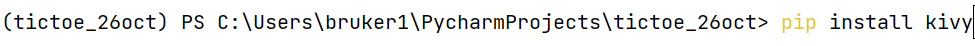
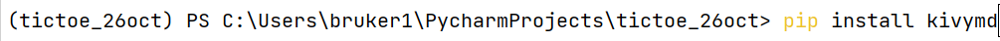
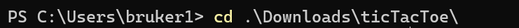
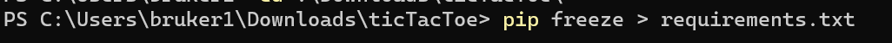
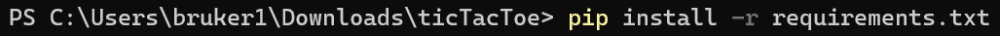
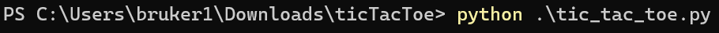
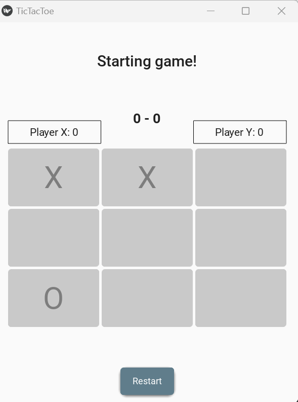

## Tic tac Toe Code

### Introduction:
The given scripts outlines the adoption of automatic computer player for Tic Tac Toe game. 
This game is developed using Kiv Framework in combination of KivyMD library to enhance the user 
experience, allowing for a modern and responsive mobile interface. The game features a 3 x 3 grid to serve as a board
where two players refers as player "X" and player "O", take turn
aiming to get their marks in a row either horizontally, vertically, or diagonally to win the game.
The game is declared a draw if all positions on the board are filled without any player achieving
three marks in a row. The score of each player is displayed at the top of the interface,
and players can restart the game when the game is over using restart button.

### Overview:
1) <b>Game Objective</b>: Implement Tic-Tac-Toe game using Python.</b>
2) <b>User Interaction</b>: The game is designed to play automatically by program, without the user put in the mark.
3) <b>Libraries use</b>: The game is built using Kivy Framework(UI design) and random library in Python.
4) <b>Game process</b>: The game is randomly selects a location on the board to place a mark, no user input request.
5) <b>Game display</b>: The board plays automatically after each turn until a player "X" or "O" win or ends in a draw.
6) <b>Tie Game</b>: If a game result in a draw, its return -1.
7) <b>Key Function</b>:
       - play_game() : Main function handling the game play.
       - creat_board() : 
       - random_place() : Randomly chooses unoccupied location on the board to place in the player's mark.
       - winner() : Check if there is any winning move.
       - update_scoreboard() : To count the score of player "X" and "Y" until the player exit the game.
       - The application is initialized and run through the main entry point: 
   
         `if __name__ == "__main__":
              TicTacToeApp().run()`

### Set Up the game:

<b>a) Setting up a new Python project</b>: 
   - Start by opening PyCharm or VSCode.
   - Create new Python project.
      <h6></h6>
      
      
     - Choose the python version that's right for you.
       - <b>Install Kivy and KivyMD on local terminal.</b> 
       
     `pip install kivy`

     
       
     `pip install kivymd`
     
     
Then, Make sure you have installed all the required packages. Execute the command within your Python environment. A Kivy window will appear on your display.
      
<b>b) Running an app using terminal</b>:
   - Download "tic_tac_toe.py" 
   - Create a directory for these files, naming its base on your preference.
   - Open terminal:

     - Create virtual environment (optional).
     - Navigate to the directory containing your files with the command using.
     
     `cd path_to_folder`

     

     - Update the requirements file with:
     - 
     `pip freeze > requirements.txt`
   
      
    
     
     - Install required packages with: 
     
     `pip install -r requirements.txt`
     
     
     
     - Execute the script with 

       `python tic_tac_toe.py`
     
      
     
      
      
       
<b>c) Install from the provided source</b>: 

If you'd like to use a pre-existing source, you can clone and install from the following GitHub repository:
`https://github.com/source_name/tic_tac_toe.git`

After all those installation, you are good to go with Tic-tac-toe Kivy application.

Note: Kivy app can not be run on Jupyter notebooks, due to jupyter notebooks operate in an interactive environment, but they are not set up to handle continuous, interactive, standalone GUI applications by default. 

### Code Summary:
<b>1. Import and Initialization</b>
   - Libraries and modules are imported like `kivy`, `kivymd`, `numpy`, `random`, and `Clock`.
   - The window size for the app is set to 400 x 500 pixels.
   
<b>2. Kivy Design:</b>
   - A Kivy language string (`KV`) is implemented to define the app layout includes, 
      - The game status label at the top.
      - A  3 x 3 grid layout for the board
      - Scores labels for two players display on the left and right, 
      - A`Restart` button at the bottom.
     
<b>3. Implementing the game logic:</b>

a. Application Initialization:
      - `TicTacToeApp`: class is derived from `MDApp` knows as the main application class, th primary class for building mobil app using python.
b. Setting up the game Interface: 
      - `build()`: Its loads the Kivy string which define the UI and sets up the app theme.
c. Starting the game:
      - `on_start()`: When the game kickoff , this function is called to display the board and players.
d. Game play Mechanics:
      - `play_game()`: Making random move for each player and check if there is a winner after every move.
        - `random_place()`: Place the mark randomly for current player on the board. 
           - Then `possibilities()`: will find all empty spot on the board to ensure the placement is valid.
        - `Winner()`: Check if there is any winner or the game is a draw -1, if the game is draw. It utilizes helper function to achieve this.
           - The same as `row_win()`, `col_win()`, `diag_win()`: Check for winning condition in rows, columns, and diagonal.
e. Game Restart and Score Keeping:
      - `new_game()`: If player wish to play again or restart midway, this function restart the board, ensuring  fresh start.
      - `restart_game`: call `new_game` function to reset the game.
      - `update_scoreboard()`: Keeping track of wins, loses, and drawis essential for competitive play. The function updates the score every round.
f. User Interface:
      - `hightlight_win()`: WHen the player wins, this function marks the wining sequence on the board.
<b>4. Running the game:</b>
   - It launches the Tic tac toe app, if the scripts is run directly `TicTacToeApp().run()`.

### How the game works:
   - Run the Scripts.
   - The board is created and the game initialized after 2 seconds.
   - Player "X" or "Y" mark random positions on the board.
   - The board is printed after every move. Both takes turn until someone gets three of their symbols in a row, either horizontally, vertically, or diagonally.
   - The game check for winning conditions after every move, row, column, diagonal after each move.
   - The game will announced if the winning is found; if not, the game declare a draw after 9 move.
   - An option to ask the player if they want the program to play again, "Restart". 
   - The tally scores of players "X" and "O" until the player exits the game.

### Conclusion: 
This implementation of automatic Tic Tac Toe capitalizes on the capabilities of the Kivy and KivyMD libraries
to create an interactive game interface. The code clearly outlines the structure of each function, such as checking for a win 
or making a move. Furthermore, the game provides feedback to the player through the score display and status label,
The restart function ensures players can quickly jump into a new game after each round. Overall,
this version of Tic Tac Toe merges traditional game mechanics with modern programing techniques to offer an enjoyable digital gaming experience.
